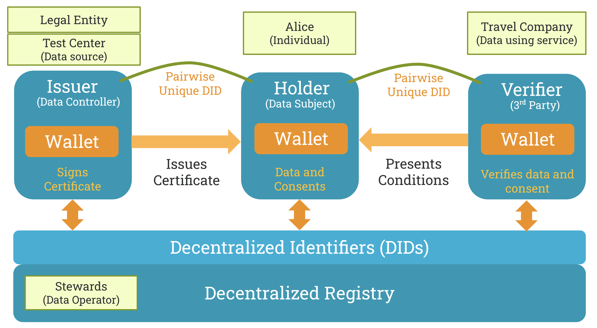
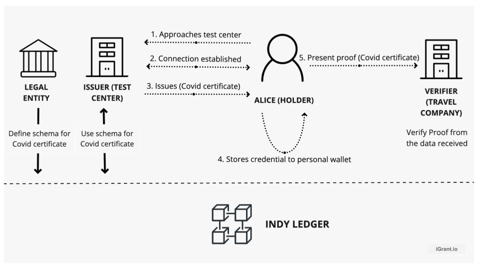
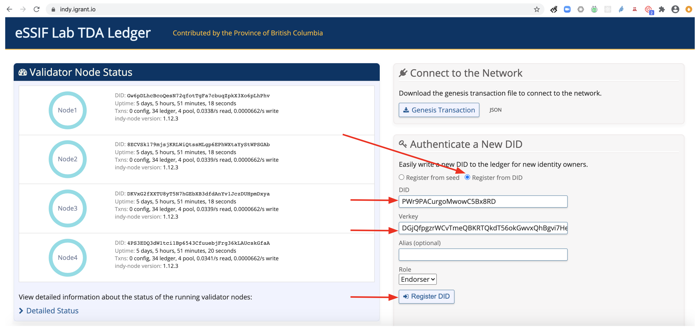

# Credential Issue and Verification API User Guide
## Table of Contents

- [Credential Issue and Verification API User Guide](#credential-issue-and-verification-api-user-guide)
	- [Table of Contents](#table-of-contents)
- [Introduction](#introduction)
- [Reference system](#reference-system)
- [Work flow](#work-flow)
- [Create DID in a wallet](#create-did-in-a-wallet)
- [Schema definition by a legal entity](#schema-definition-by-a-legal-entity)
- [Establish connection between Issuer and Holder](#establish-connection-between-issuer-and-holder)
	- [Automated work flow](#automated-work-flow)
	- [Manual work flow](#manual-work-flow)
- [Credenial issuance by the issuer (Test Center)](#credenial-issuance-by-the-issuer-test-center)
	- [Automated work flow](#automated-work-flow-1)
	- [Manual work flow](#manual-work-flow-1)
- [Stores credential into a personal wallet (Data4Life)](#stores-credential-into-a-personal-wallet-data4life)
- [Proof presentation by Holder (Data4Life) to Verifier (Travel Company)](#proof-presentation-by-holder-data4life-to-verifier-travel-company)
	- [Automated work flow](#automated-work-flow-2)
	- [Manual work flow](#manual-work-flow-2)
- [References](#references)

# Introduction
This describes the API call flows during a verified data exchange process using hyperledger Indy as the distributed ledger registry and hyperldge aries agent for client application. 

The indy network is up and running at https://indy.igrant.io/. The aries agents are connected to this network and configured locally as described [here](https://github.com/decentralised-dataexchange/aries-playground/blob/master/README.md). Executing the sequence of operations described creates the reference system described [below](#Reference-system).

# Reference system
In our reference implementation, we have the individual (Alice) holding her health data in her wallet app (Data4Life) issued by a Health Test Center. This health data could be used by Alice to prove her health status to a travel company. The legal entity ensures that the test center follows the schema and governance. 

Once the reference system is up and running you can start 3 terminals and monitor their logs by executing the docker container logs given below:

| Agent  | Swagger API endpoint admin UI | 
| ------------- | ------------- | 
| Test Center | `docker exec -it test-center.webhook tail -f demo.log`| 
| Alice (Data4Life User) | `docker exec -it data4life-user.webhook tail -f demo.log` | 
| Travel Company | `docker exec -it travel-company.webhook tail -f demo.log`| 

In your browser you can start three tabs to execute the APIs using swagger.

| Agent  | Swagger API endpoint admin UI | 
| ------------- | ------------- | 
| Test Center | [test-center.swagger.localhost](http://test-center.swagger.localhost) | 
| Alice (Data4Life User) | [data4life-user.swagger.localhost](http://data4life-user.swagger.localhost) | 
| Travel Company | [travel-company.swagger.localhost](http://travel-company.swagger.localhost) | 

# Use case Scenario
Alice is a travel vloger, Her next destination is dubai but, due to covid pandemic, she has to prove to a travel agent, that her result is negative. So that she will be allowed to travel.  
Alice listed out the things she has to do:  
1. Visit a covid test center  
    **Note:** Test center should follow a schema defined by a legal entity to issue the certificate. Refer [schema definiton by legal entity](#schema-definition-by-a-legal-entity)  
    - Test center and alice creates a connection to exchange information. Refer [Establish connection between Issuer and Holder](#establish-connection-between-issuer-and-holder)  
    - The Test center will test alice's samples and issues a certificate. Refer [Credenial issuance by the issuer](#credenial-issuance-by-the-issuer-test-center)
    
2. Store the issued credentials to her wallet. Refer [Stores credential into a personal wallet](#stores-credential-into-a-personal-wallet-data4Life)  
3. Present proof to travel agent. Refer [Proof presentation by Holder](#proof-presentation-by-holder-data4life-to-verifier-travel-company)  
  
Alice will be allowed to travel affter completing these steps.  

# Work flow  
The work flow can be performed either manually or automatically. By default it will be automatic. To make it manual replace the code of [startup.sh](https://github.com/decentralised-dataexchange/aries-playground/blob/master/cloud-agent/startup.sh) with code of [startup_temp.sh](https://github.com/decentralised-dataexchange/aries-playground/blob/master/cloud-agent/startup_temp.sh)

# Create DID in a wallet

The steps below to create DID in a wallet is a pre-requesite for any agent before acquiring agent roles.

1. Create a local DID for the agent using `POST ​/wallet​/did​/create`	This generates the DID and verification key
	
2. For organisations, After creating local DID, you need to register it with ledger at [indy.igrant.io](https://indy.igrant.io/) as shown below

	
After registering with the Indy ledger call `POST /wallet/did/public`

# Schema definition by a legal entity
To make it easier, we have used the [Test Center Agent](http://test-center.swagger.localhost) to register the schema. Ideally this is defined by a legal entity or a standardisation body. 

You can execute the schema definiton API to register the schema in the ledger.   

To define schema first you have to create a public DID. This is done following the previous step: [Create DID in a wallet](#create-did-in-a-wallet)  

Sends a schema to the ledger with the API `POST: ​/schemas` with the json body as given:
	    
    {
      "schema_version": "1.0",
	   "schema_name": "Covid-19 Test Results",
	   "attributes": [
	     		"testResult",
	     		"testDate"
      		]	
     }

Try out on your local machine at: [http://test-center.swagger.localhost/api/doc#/schema/post_schemas](http://test-center.swagger.localhost/api/doc#/schema/post_schemas)

# Establish connection between Issuer and Holder
 
Here, the Test Center and Data4Life-User agents establishes connection with each other. Following are the API call sequence:

## Automated work flow
1. Create a new invitation (by Test Center)

	Test Center Agent: `POST ​/connections​/create-invitation`
	
	This generates the `connection_id` and `invitation`.
	
	    {
	     "connection_id": "e18c5108-4040-4a1e-b994-e80eaab5e3d2",
	     "invitation": {
	       "@type": "did:sov:BzCbsNYhMrjHiqZDTUASHg;spec/connections/1.0/invitation",
	       "@id": "903fc685-0463-4f92-93ff-43dbdbfb1297",
	       "serviceEndpoint": "http://test-center.localhost",
	       "recipientKeys": [
	           "7eCdJgj5r5ZjGYqVJYGTjdjFqxNnP3oWxYseagPoB1gg"
	        ],
	       "label": "Test-Center"
	     },
	     "invitation_url": "http://test-center.localhost?c_i=eyJAdHlwZSI6ICJkaWQ6c292OkJ6Q2JzTlloTXJqSGlxWkRUVUFTSGc7c3BlYy9jb25uZWN0aW9ucy8xLjAvaW52aXRhdGlvbiIsICJAaWQiOiAiOTAzZmM2ODUtMDQ2My00ZjkyLTkzZmYtNDNkYmRiZmIxMjk3IiwgInNlcnZpY2VFbmRwb2ludCI6ICJodHRwOi8vYWdlbnQzLmxvY2FsaG9zdCIsICJyZWNpcGllbnRLZXlzIjogWyI3ZUNkSmdqNXI1WmpHWXFWSllHVGpkakZxeE5uUDNvV3hZc2VhZ1BvQjFnZyJdLCAibGFiZWwiOiAiVHJhdmVsLUNvbXBhbnkifQ=="
	    }
	    	
	Try out on your local machine at: [http://test-center.swagger.localhost/api/doc#/connection/post_connections_create_invitation](http://test-center.swagger.localhost/api/doc#/connection/post_connections_create_invitation)

2.	Receive a new connection invitation by Data4Life-User (Alice) with the connection_id.

	Alice Agent: `POST ​/connections​/receive-invitation` with the invitation invitation json (shown below) generated in step 1 as input. 
	
		`{
	      "@type": "did:sov:BzCbsNYhMrjHiqZDTUASHg;spec/connections/1.0/invitation",	      "@id": "903fc685-0463-4f92-93ff-43dbdbfb1297",
	      "serviceEndpoint": "http://test-center.localhost",
	      "recipientKeys": [
	           "7eCdJgj5r5ZjGYqVJYGTjdjFqxNnP3oWxYseagPoB1gg"
	        ],
	      "label": "Test-Center"
	  	}`

3. Accept a received connection invitation by Data4Life-user (Alice)

	Alice Agent: `POST ​/connections​/{conn_id}​/accept-invitation` passing the `connection_id` as input.  

## Manual work flow
1. Repeat steps 1 - 3 of  automated workflow.
2. Now the connection will be in request state, Issuer (Test Center) has to accept the request  
Test Center Agent: `POST /connections​/{conn_id}​/accept-request`  
Now the state changes to response
3. To make the connection active we have to call the trust ping endpoint either from issuer (Test Center) or from holder (Alice).  
Test Center/Alice Agent: `POST /connections​/{conn_id}​/send-ping`  

Check both Test Center Agent and Alice Agent by `GET /connections `and both are in `Active` status  

After the secured connection is established between the two agents, the Test Center first establishes the connection with Alice. After that the Test Center issues credential to them with their own personal data. Alice then is able to see the credential in her Data4Life wallet.

# Credenial issuance by the issuer (Test Center)

Here, a credential is issued by the Test Center based on a standard scehma earlier defined by the legal entity.

1. Create a local DID for the test center and make it public by publishing it to the ledger. Follow the previous instruction: [Create DID in a wallet](#Create-DID-in-a-wallet).
	
2. Repeat step 1 to create DID for the Data4Life-User, but DO NOT publish this to ledger as it shall remain private. 

3. Now, based on the schema, Test Center creates a credential definition to the ledger.
	
	An example scheme ID and name is as given. Please use the ones that were created during schema defintion or pick one from indy ledger.

	Schema ID: PWr9PACurgoMwowC5Bx8RD:2:Covid-19 Test Results:1.0
	Schema Name: Covid-19 Test Results:1.0
	
	`POST method /credential-definitions` sends a credential definition to the ledger 
	
	**NOTE:** Make sure revocation is false in the paylod example as given below: 
	
	    {
		  "revocation_registry_size": 0,
		  "support_revocation": false,
		  "schema_id": "PWr9PACurgoMwowC5Bx8RD:2:Covid-19 Test Results:1.0",
		  "tag": "default"
		 }`

## Automated work flow
		
4. Test Center now issues the credenital to the holder Alice (Data4Life-user)
	
	Test Center Agent: `POST ​/issue-credential​/send`
	
	with auto_remove set to FALSE
	
	    { 
	     "schema_name": "Covid-19 Test Results",
	     "schema_version": "1.0",
	     "cred_def_id": "PWr9PACurgoMwowC5Bx8RD:3:CL:19:default",
	     "auto_remove": false,
	     "comment": "string",
	     "connection_id": "a8ea680f-0704-4327-99b8-02e5e3d03ea4",
	     "trace": false,
	     "schema_issuer_did": "PWr9PACurgoMwowC5Bx8RD",
	     "schema_id": "PWr9PACurgoMwowC5Bx8RD:2:Covid-19 Test Results:1.0",
	     "issuer_did": "PWr9PACurgoMwowC5Bx8RD",
	     "credential_proposal": {
	     "@type": "did:sov:BzCbsNYhMrjHiqZDTUASHg;spec/issue-credential/1.0/credential-preview",
	     "attributes": [
	        {
	          "name": "testDate",
	          "mime-type": "text/plain",
	          "value": "22-Aug-2020"
	        },
	        {
	          "name": "testResult",
	          "mime-type": "text/plain",
	          "value": "negative"
	        }
	      ]
	     }
	    }

## Manual work flow

4. Issuer (Test Center) sends a offer with the result of the test.  
Test Center Agent: `POST/issue-credential​/send-offer`  
	
	**Note:** In request body auto issue and auto remove should be false  

        {
          "cred_def_id": "WgWxqztrNooG92RXvxSTWv:3:CL:20:tag",
          "credential_preview": {
            "@type": "did:sov:BzCbsNYhMrjHiqZDTUASHg;spec/issue-credential/1.0/credential-preview",
            "attributes": [
	        {
	          "name": "testDate",
	          "mime-type": "text/plain",
	          "value": "22-Aug-2020"
	        },
	        {
	          "name": "testResult",
	          "mime-type": "text/plain",
	          "value": "negative"
	        }
	        ]
          },
          "connection_id": "3fa85f64-5717-4562-b3fc-2c963f66afa6",
          "auto_issue": false,
          "comment": "string",
          "trace": false,
          "auto_remove": false
        }
	
	Now the state will be offer_sent for Issuer (Test Center)  
   
   **Note:** `GET /issue-credential​/records` to view the state    

5. Alice will call `GET /issue-credential​/records`  
The state will be offer_received and from this response copy the credential exchange id.  

6. Alice will send request to issue the credential using credential exchange id.  
Alice Agent: `POST /issue-credential​/records​/{cred_ex_id}​/send-request`  
Now the state will be request_sent for Alice

7. Issuer (Test Center) will call `GET/issue-credential​/records`  
The state will be request_received and from this response copy the credential exchange id.

8. Issuer (Test Center) issues the certificate using credential exchange id  

Test Center Agent: `POST /issue-credential​/records​/{cred_ex_id}​/issue`  

Now, the credential will be issued to Alice and state will change to  credential_issued   

# Stores credential into a personal wallet (Data4Life)

In the case of automated flow, the credential is automatically stored into the wallet. In the case of manual flow, this need to be done explicitly.

For manual flow, Alice, the Data4Life-User, now stores the received credentials

Alice Agent: `POST ​/issue-credential​/records​/{cred_ex_id}​/store`

Data4Life user can fetch the credentials from the wallet by `GET /credentials` 

# Proof presentation by Holder (Data4Life) to Verifier (Travel Company)

Before any communication happens between Alice (Data4Life-User) and the verifier, a secured connection is established between two agents. After that Travel Company issues a proof request to Alice, showing what type of proof is needed to qualify in order for Alice to travel using the Covid-19 test result. Alice will build the proof based on the credential in her Data4Life wallet. Alice then sends the proof to the travel company which will observe the result.
## Automated work flow
1. Establish connection

	Travel Company Agent: `POST /connections/create-invitation`, from the response get the invitation object (from `{ to }`) as shown earlier during the connection between Test Center and Alice.

	Alice Agent: `POST /connections/receive-invitation` with the invitation object

2. Accept a stored connection invitation by Alice (Data4Life user)

	Alice Agent: `POST ​/connections​/{conn_id}​/accept-invitation` passing the `connection_id` as input.

Check both Travel Company Agent and Alice Agent by `GET /connections `and both are in `Active` status

After the secured connection is established between the two agents, the Travel Center request a proof from Alice as per the credenital defintion. The following steps cover that flow.

3. In this demo, the Proof request details the Test Center is asking for is

    	testResult
    	testDate

    all items follows the Credential Definition specified by the ID
    
   Travel Center Agent: `POST /present-proof/send-request` is called with the following payload (example)

	    {
	      "connection_id": "a8ea680f-0704-4327-99b8-02e5e3d03ea4",
	      "comment": "Ready to travel",
	      "proof_request": {
	      "name": "Proof of COVID19 Negative",
	      "version": "1.0",
	      "requested_attributes": {
	      "0_testresult_uuid": {
	        "name": "testResult",
	        "restrictions": [
	          {
	            "cred_def_id": "PWr9PACurgoMwowC5Bx8RD:3:CL:19:default"
	          }
	        ]
	       },
	       "0_testdate_uuid": {
	        "name": "testDate",
	        "restrictions": [
	          {
	            "cred_def_id": "PWr9PACurgoMwowC5Bx8RD:3:CL:19:default"
	          }
	        ]
	       }
	     },
	     "requested_predicates": {}
	    }
   
   Using the requested_predicates, you can do some assertions, example, the testDate shall be less than 2 days from today. 
   
   In the webhook interceptor, you can view the sequence of events happening:

	* receiving the proof request
	* checking credentials
	* generating proof
	* sending proof to Travel Company

4. From Travel Company, we can use `GET /present-proof/records` to see the proof sent by Alice. The `presentation_exchange_id` is the identifier of the presentation proof and state will tell you the current status of the presented proof.  

## Manual work flow
1. Repeat steps 1 - 2 of automated flow
2. Now the connection will be in request state, Verifier (Travel company) has to accept the request.  
Travel Company Agent: `POST /connections​/{conn_id}​/accept-request`  
Now the state changes to response.
3. To make the connection active we have to call the trust ping endpoint either from Verifier (Travel company) or from holder (Alice).  
Travel Company/Alice Agent: `POST /connections​/{conn_id}​/send-ping`  
4. Perform step 3 of automated flow.
5. Holder (Alice) has to get the presentation exchange id  
   Alice Agent: `GET /present-proof/records`
6. Holder (Alice) will send the presentation  
   Alice Agent: `POST
​/present-proof​/records​/{pres_ex_id}​/send-presentation` is called with the following payload (example)  

    	{
    		"requested_predicates": {
    		},
    		"trace": false,
    		"self_attested_attributes": {
    		},
    		"requested_attributes": {
        		"0_testresult_uuid": {
        			"cred_id": "b5df5eac-047f-4ad0-98cc-7e6138a2f339",
        			"revealed": true
        		},
        		"0_testdate_uuid": {
        			"cred_id": "b5df5eac-047f-4ad0-98cc-7e6138a2f339",
        			"revealed": true
        		}
    		}
    	}
**Note:** requested_attribute fields keys should be same as in the body of  `POST /present-proof/send-request`   
7. Finally Travel Company use `POST /present-proof/{pres-ex-id}/verify-presentation` to see Alice’s proof presentation.

# References
[1] [Setting up indy network and agents](https://github.com/decentralised-dataexchange/aries-playground/blob/master/README.md) 
